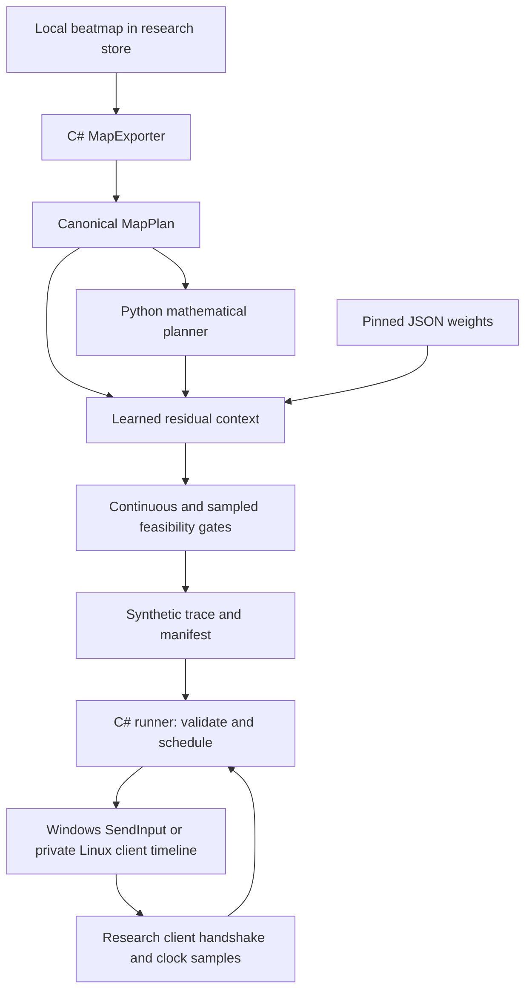

# HSR technical guide

**Human Simulator Research · Intelligence Database**

HSR is a research fork of osu!lazer for Windows and Linux. Linux uses private
client input for X11 and Wayland. It generates visibly synthetic
movement and key traces from decoded beatmaps, compares mathematical and learned
movement, and executes traces through a guarded runner against its own client.
It is independent of ppy Pty Ltd. The upstream base is `2026.726.0-lazer`.

## Contents

1. [Distribution and implementation status](#1-distribution-and-implementation-status)
2. [Installation and operation](#2-installation-and-operation)
3. [Architecture and source map](#3-architecture-and-source-map)
4. [Mathematical planning](#4-mathematical-planning)
5. [Learned residual movement](#5-learned-residual-movement)
6. [Data formats and identities](#6-data-formats-and-identities)
7. [Runner protocol and dispatch](#7-runner-protocol-and-dispatch)
8. [Training and reproducibility](#8-training-and-reproducibility)
9. [Local V2 evaluation](#9-local-v2-evaluation)
10. [Security and privacy](#10-security-and-privacy)
11. [Testing and troubleshooting](#11-testing-and-troubleshooting)
12. [Maintenance and release process](#12-maintenance-and-release-process)

## 1. Distribution and implementation status

| Direction | Status | What users receive |
|---|---|---|
| Separate osu!lazer research build | Implemented | Fork source with HSR preinstalled, runner, tools and pinned JSON model; Linux uses private client input for X11 and Wayland |
| Extension for official osu!lazer | Feasibility design | Architecture and acceptance requirements; no extension DLL |

### Separate research build

Build with `HumanSimResearchBuild=true`. The flag defines the research boundary
in the game assembly: login is disabled and score-token retrieval/submission
are blocked. The HSR mod is unranked, requires a local runner handshake, and
shows **Intelligence Database | SYNTHETIC RESEARCH RUN** during gameplay.
The desktop host uses `osu-development` storage and a separate
`osu-human-sim-research` instance pipe. Research builds disable production
updating, legacy IPC, automatic updater restart and Discord presence.

This release is source plus a small JSON model. Build outputs, SDKs, Python
environments and acquired replay/map datasets are not release assets. Original
upstream test resources remain in the source tree with upstream attribution.

### Official-client extension direction

The official lazer loader discovers assemblies containing public `Ruleset`
subclasses. It does not merge arbitrary `Mod` DLLs into osu!standard. Therefore
the current HSR mod cannot simply be copied into an official installation.

A possible extension is a separate **HSR Research custom ruleset**, with its
own identity, mod catalog and synthetic playback input pipeline. It should
use the official extension interface rather than attach the external runner
to production gameplay. A first deliverable could be an offline trace viewer.

Required acceptance checks before shipping an extension:

- Pin compatibility to a tested official client version and ruleset API.
- Keep synthetic playback clearly labeled, including the watermark.
- Keep score-token requests, uploads, multiplayer and leaderboard effects
  disabled for research runs; `Ranked == false` alone does not establish this.
- Demonstrate equivalent isolation without assuming this fork's core hooks
  exist in the official host.
- Verify installation, update/removal, imported-map handling and input cleanup.
- If host APIs cannot enforce isolation, ship an offline viewer or retain the
  separate-build direction.

osu!stable is not supported by this proposed ruleset-extension direction.
See [distribution analysis](../research/DISTRIBUTION_OPTIONS.md), the
[official loader](https://github.com/ppy/osu/blob/master/osu.Game/Rulesets/RulesetStore.cs)
and [official custom-mode documentation](https://osu.ppy.sh/wiki/en/Game_mode#custom-game-modes).

## 2. Installation and operation

### Requirements

- Windows 10 or newer, or Arch Linux x86_64 with X11 or Wayland.
  PowerShell 7 is recommended on Windows.
- Python 3.12; the pinned environment was verified on Windows Python 3.12.
- A patched .NET 8 SDK on PATH or installed under repository `.dotnet`.
  SDK 8.0.425 / host and runtime 8.0.31 were verified locally.
- Git and a local library of appropriately licensed beatmaps.
- Network access for initial Python/NuGet dependency installation.

The Arch package workflow is documented in
[`packaging/arch/README.md`](../packaging/arch/README.md). The PKGBUILD is
prepared but has not yet been built under Arch or published to the AUR. .NET 8
support ends on 2026-11-10; migrate the package and CI to a supported runtime
before then.

Clone the repository and prepare the Python environment:

```powershell
git clone https://github.com/Enterlessguy/OSU-HSR.git
Set-Location OSU-HSR
.\research\setup-research.ps1
.\research\run-dev-build.ps1
```

The setup script creates `research/human-sim/.venv`, installs the pinned
runtime/test requirements, then installs HSR from the selected checkout.
The launcher prompts for the profile, builds the research client and three
tools, checks planner identities, verifies the pinned model file hash, and
starts automatic planning. It leaves the terminal available for diagnostics.
Cached local restore assets are reused; a clean checkout restores packages.

Import beatmaps into the **research client**. Select the Human Simulator
Research mod and a supported osu!standard difficulty. Selecting a map permits
the runner to prepare a trace; gameplay begins only after its acknowledgement.
Do not point the runner at an official production installation.

### Explicit builds

```powershell
.\research\build-research.ps1 -Configuration Release
dotnet build research/HumanSim.Runner/HumanSim.Runner.csproj -c Release
dotnet build research/HumanSim.MapExporter/HumanSim.MapExporter.csproj -c Release -p:HumanSimResearchBuild=true
dotnet build research/HumanSim.ReplayExtractor/HumanSim.ReplayExtractor.csproj -c Release -p:HumanSimResearchBuild=true
```

The interactive launcher uses Debug output paths. Build Debug tools as well
when using the CLI's live-run wrappers directly. Release build commands are
for release verification; they do not switch those wrappers' Debug paths.

### Generate and inspect a trace without gameplay

Export a `MapPlan` using the exporter, then use the repository Python environment:

```powershell
dotnet research/HumanSim.MapExporter/bin/Release/net8.0/HumanSim.MapExporter.dll --map path/to/map.osu --output map-plan.ndjson.gz
```

```powershell
$python = '.\research\human-sim\.venv\Scripts\python.exe'
& $python -m human_sim.cli plan map-plan.ndjson.gz math.trace.ndjson.gz --percentile 99.5 --seed 42 --execution-mode math-only
& $python -m human_sim.cli plan map-plan.ndjson.gz hybrid.trace.ndjson.gz --percentile 99.5 --seed 42 --execution-mode coherent --execution-model research/human-sim/models/experimental/seed101-math-residual-g100-v4.json --execution-blend 1
& $python -m human_sim.cli validate hybrid.trace.ndjson.gz
```

`human-sim --help` and each subcommand's `--help` are the authoritative option
reference. Profile skill/effort accept 0–100. The perfect mode is a diagnostic
mathematical control, not a human model. Coherent execution requires a model
and positive blend; a map without delivered learned movement fails explicitly.

## 3. Architecture and source map



| Component | Source | Responsibility |
|---|---|---|
| Research host | `osu.Desktop/Program.cs`, `OsuGameDesktop.cs` | Separate instance/storage, updater isolation |
| Boundary | `osu.Game/Research/ResearchBuild.cs` | Login/submission policy |
| Client mod | `osu.Game.Rulesets.Osu/Mods/OsuModHumanSimulatorResearch.cs` | Watermark, handshake, gameplay gates, clock samples |
| Map exporter | `research/HumanSim.MapExporter` | Decode with lazer, effective geometry/timing |
| Mathematical planner | `research/human-sim/src/human_sim/planner.py` | Route, aim, timing, key schedule and baseline movement |
| Residual adapter | `coherent_execution.py` | Learned interior movement and feasibility controller |
| Numerical trainer | `coherent_training.py` | Context admission, curve-space fit |
| CLI | `cli.py`, `io.py`, `validation.py` | Plan, serialize, validate and launch tools |
| Runner | `research/HumanSim.Runner/Program.cs` | Content verification, planning, scheduling, abort/cleanup |
| Replay extractor | `research/HumanSim.ReplayExtractor` | Offline replay decode and pseudonymous research export |
| Benchmark scripts | `research/human-sim/scripts` | Calibration, paired development cases and audits |

Historical phase-law, path-execution and other candidate modules are retained
for research history. The default `coherent` route selects the pinned v4
residual model; their presence does not mean they are active in that route.

## 4. Mathematical planning

The mathematical planner owns **where and when**: object order, effective
positions, slider paths, spinner geometry, free-roam destinations, hit windows
and key events. A seeded profile controls timing/aim variation, bias, drift,
strain, consistency and correction behavior. The same seed/profile yields the
same baseline under the same source and numerical environment.

Circle movement carries position, velocity and acceleration state through
quintic Hermite segments. For duration `T` and normalized time `u=t/T`, endpoint
constraints are:

```text
p(0)=p0        p(1)=p1
dp/dt(0)=v0   dp/dt(1)=v1
d²p/dt²(0)=a0 d²p/dt²(1)=a1
```

These six constraints determine each coordinate's degree-five polynomial.
Shared endpoint states avoid independently restarted transitions. Persistent
curvature, correlated movement and conditional corrections vary execution.
The planner also handles slider tracking, spinner motion and idle/free-roam
behavior. These modes remain mathematical in the released residual adapter.

Trace planning normally samples at 500 Hz. The automatic runner detects
ultra-dense source maps and promotes planning to 1,000 Hz. Key-event frames
remain part of the trace; the learned adapter cannot retime or reorder them.
This generation rate is not a guarantee of equivalent physical OS delivery
precision, which depends on scheduling, focus, rendering and host load.

## 5. Learned residual movement

### Context and model

The released model is a bounded ridge-regression curve model, not a large
neural network. It was fitted on 198 contexts from 100 independent TRAIN
map/player components, with seed 101. The runtime takes consecutive eligible
four-circle contacts. Other object modes and gaps of at least 750 ms separate
runs; insufficient timing/sample support is rejected.

The context contains contact positions/times, route-normalized geometry,
incoming movement state and node/dwell information. There are 22 input
features, up to seven nodes, 45 padded curve coefficients, and two coordinate
outputs. Standardization plus an intercept yields a weight tensor `(45,23,2)`.
The task basis combines P/V/A node states with four interior detail modes per
span. Masks prevent unwanted coefficients from changing fixed contacts.

### Composition

Let `m(t)` be the actual generated math path. Let `b(t)` be the task baseline
used to encode the model context, and `s(t)` its learned task signal. The
residual is `d(t)=s(t)-b(t)`. The delivered path is:

```text
x(t) = m(t) + alpha * d_g(t)
d_g = d + (g-1) * normal * dot(d, normal)
g = 1.5
```

The lateral gain is applied to coefficients before both safety checks.
The outer residual P/V/A states are zero, and contact position deltas are
zero. Interior velocity/acceleration may change while joins remain continuous.
Preserving contacts does not make an already missed mathematical contact a hit.

### Strength selection

The controller searches strengths 1.00, 0.99, …, 0.00, multiplied by the
requested blend. Only a positive feasible strength is accepted. It checks:

1. **Continuous residual envelope:** span-polynomial extrema of derivative
   norms, including endpoints and real interior stationary roots.
2. **Sampled delivered path:** exact finite-difference kinematic summaries
   against absolute limits or a 1% allowance over that window's math baseline,
   whichever is greater, plus numerical tolerance.

Continuous residual limits are 12,000 px/s, 120,000 px/s² and 2,500,000 px/s³.
These bound the added residual; they do not assert that every baseline sample
already meets a universal human threshold. Extrema are found once at full
strength; scaling all derivative norms by `abs(alpha)` preserves their roots.
Tests and 43 paired cases verify equivalence to the earlier repeated-root search.

Nonfinite, unsupported, zero-delta or infeasible windows retain baseline
movement and record a fallback reason. Accepted windows must change coordinates.
Timestamps and key states remain identical between paired arms. Missing or
corrupt weights, zero coherent blend and entirely math-only coherent output
are explicit failures rather than successful learned runs.

## 6. Data formats and identities

### MapPlan schema 1

The exporter writes gzip NDJSON containing the canonical plan JSON. Fields
include `schema_version`, beatmap SHA-256/MD5, active mods, clock rate,
metadata and ordered objects. Each object includes kind, effective start/end
time in milliseconds, position/end position, radius, repeats, sampled slider
path and hit windows. Coordinate units use the osu! 512×384 playfield.
Supported research mod identifiers are HD, HR, DT, HT and FL. DT and HT cannot
be combined. Effective timing and playable geometry come from lazer's decoder.

### Trace schema 1

The first NDJSON row is `trace_header`; subsequent rows contain `time_us`,
`x`, `y`, `k1`, `k2`. `time_us` is relative to a timeline beginning 1,500 ms
before the first object's effective start. Header metadata records that
absolute start, coordinate space, seed/profile, sample rate, map/mod/clock
identity, planner version, Git commit, model identity and execution diagnostics.
`synthetic: true` is permanent and mandatory for runner acceptance.

Gzip output uses a zero modification timestamp and empty embedded filename,
reducing incidental serialization differences. A sidecar manifest binds the
map plan, model/configuration and trace hashes. Generation-time metadata can
change when the Git commit changes even if coordinates do not.

### Model identities

The loader enforces a 5 MiB file limit, canonical JSON SHA-256, allowed seed/
group contract, distinct component count, exact tensor shapes, finite values
and positive feature scales. The release model's raw file SHA-256 is:

```text
3ba4d157124fa078b862062a38578561265bf03aaa2180a566440874b22bc7a2
```

Canonical SHA-256:

```text
7b87af291bca415c1f053ca515659c091ce9f2c1b280283fc129211a79ce0d87
```

Keep the model's LF bytes intact. See the [model card](../research/human-sim/models/experimental/README.md)
for frozen fitting-source identities and provenance. Raw file and canonical
hashes serve different purposes; neither is an authenticity signature.

## 7. Runner protocol and dispatch

The runner launches its selected research client, creates random local named
pipes and a one-time token, and supplies the connection information to that
child. Pipes use current-user access restrictions. The mod supplies a hello
containing protocol version, token, PID, executable SHA-256, map/mod identity,
clock rate, QPC frequency and playfield transform. The runner validates these
against the process it launched and the selected trace.

For automatic planning, the source map is resolved from lazer's
content-addressed store using its SHA-256. The file hash must match; export
then runs the selected checkout's Python environment with `PYTHONPATH` pinned
to its source directory. Preplanning/cache keys include map, mod/rate/profile
and model identity. Planning defaults to a 180-second tool timeout.

After trace validation and acknowledgement, start/heartbeat messages provide
gameplay-clock/QPC pairs. Heartbeats are normally emitted at 50 ms intervals.
The clock model fits gameplay time against the high-resolution host clock,
tracks correction, and anchors extrapolation to recent samples. The runner
maps playfield positions to the guarded window transform. Windows schedules
ordinary `SendInput`. Linux transfers a SHA-256 checked, bounded synthetic
timeline to the client through the authenticated pipe. The client validates
token/map/rate and uses a private frame-accurate input handler with its gameplay
clock. Every scheduled cursor position and key edge is retained even when the
render clock arrives late; counters track consumed frames and learned exposure.
The handler uses normal client focus and playfield geometry on X11 and Wayland,
with no global input permission. It does not create a replay score or change
the frozen model. OS dispatch latency calibration is a separate measurement;
Windows runtime timing values do not transfer to the client timeline backend.

The guard monitors process/window identity, foreground focus, playfield/DPI
changes and connection health. Focus loss, invalid transform, process exit,
hash/pipe mismatch or a stale heartbeat aborts execution and releases held
keys. There is no driver, injection, process-memory access or production-client
attachment support. Local process compromise remains outside this boundary.

`HumanSim.Runner --verify-plan <map-sha256>` uses the actual export/planning/
trace-loader route but stops before opening the client or injecting input.
Supply normal `--client`, `--auto-plan`, `--workspace-root`, `--osu-storage`
and execution arguments. The storage argument names the directory containing
the hash prefix folders. This diagnostic establishes compiler integration,
not live delivery or captured-cursor fidelity.

## 8. Training and reproducibility

The o!rdr v155 archive is listed as CC0 by its publisher. Public score identity
checks corroborate player/map pairing and exclude known automation modifiers;
they cannot independently certify manual input or every replay's rights.
Acquired datasets and identity/admission records are not distributed.

Training admission groups connected map/player/replay identities and caps
contributions before fitting. Only TRAIN movement enters fitting. Calibration
selects scorer features/support rules; opened validation supports development
selection. Fresh player/map-family-disjoint confirmation remains unopened.

The residual target at matched timestamps is:

```text
task baseline + observed human movement - generated math movement
```

The fit uses the public `coherent_training.py` numerical core and integrated
curve-space ridge objective. With the same reviewed inputs, admission,
source, seed and numerical environment, the fitted model is deterministic.
Historical exact numerical reproduction requires the same private cohort;
normal use requires only the published weights.

After independently acquiring/reviewing the expected development inputs:

```powershell
$env:PYTHONPATH = "$PWD\research\human-sim\src"
$env:OPENBLAS_NUM_THREADS = '1'
$python = '.\research\human-sim\.venv\Scripts\python.exe'
& $python research/human-sim/scripts/train_ordr_mixed_coherent.py --prepare-only
& $python research/human-sim/scripts/train_ordr_math_residual.py --output research/human-sim/output/new-fit
```

These commands are a fitting procedure, not a downloader or one-command
recreation of the private historical cohort. The fitter records hashes of
admission, numerical sources, math planner and adapter in a frozen spec.
Never overwrite a published model under the same identity after modifying
its numerical source. Preserve source/model/scorer/case identities together.

## 9. Local V2 evaluation

The local OSI V2 work evaluates **delivered** paired traces under the same
math/key schedule, rather than trusting the configured execution label.
Calibration uses independent human references and deliberate corruptions.
Common-bandwidth extraction reduces sampling-rate confounding. Unsupported
cells are reported, not silently rescaled into a complete aggregate.

Circle criteria are speed/phase, spatial contact, continuity and coupled motor
behavior, weighted 20/20/20/10 within this component. For selected feature
distance `D`, calibration scale `s`, human-human median `n`, and corruption/
null anchor `a`, the score uses:

```text
excess = max(0, (D/s - n)/(a-n))
component score = 100 * exp(-weighted_mean(excess))
```

Maps require at least 12 supported circle windows. Differences are paired
by map; the admitted players/map families are disjoint. The script draws
20,000 paired bootstrap samples. Repeated synthetic seeds are not independent
human subjects. Opened validation results are development evidence.

| Component | Supported maps | Math | Hybrid | Paired result |
|---|---:|---:|---:|---|
| Circle | 38/43 | 62.768 | 63.887 | +1.119; 95% interval [+0.517,+1.959] |
| Slider | 43/43 | 23.458 | 23.458 | Unchanged |
| Spinner | 24/43 | 70.241 | 70.241 | Unchanged |
| Break/free roam | 31/43 | 68.396 | 68.396 | Numerically unchanged |
| Temporal diversity | 36/43 | 4.376 | 4.656 | Interval crosses zero; low absolute score |

All 43 maps delivered learned movement: 5,124 accepted windows, 146 fallbacks
and 1,006,801 changed samples. No math-legal circle became illegal among
27,387 contacts. Unsupported mode coordinates were unchanged. Matched native
cadence flicker metrics are descriptive, without calibrated equivalence margins.

The release has **no full V2 aggregate, independent confirmation,
perceptual corroboration or human-indistinguishability claim**. See
[aggregate evidence](../research/human-sim/benchmarks/LOCAL_V2_20260926.json)
and the [benchmark specification](../research/human-sim/OSI_REALISM_V2.md).

With reviewed local development data installed, run generation followed by
circle scoring, extended scoring, contact/mode/contribution/flicker audits.
The main script arguments are `--split validation`, `--model <weights>` and
`--case-tag <new-tag>` for `run_coherent_development_cases.py`, then the same
`--case-tag` for `score_osi_v2_circle_component.py`, `audit_osi_v2_extended.py`,
`audit_coherent_circle_contacts.py`, `audit_coherent_mode_boundaries.py`,
`audit_learned_contribution.py` and `audit_matched_cadence_flicker.py`.
Cached cases verify source/model/map/trace identities and reject mismatches.

## 10. Security and privacy

The boundary is enforced in both compile-time client policy and runtime
runner/mod checks. Synthetic traces are never eligible for ranked submission.
Do not remove the watermark, score gates or authenticated process binding.

Acquisition permits HTTPS only, rejects embedded URL credentials, blocks
redirect downgrades and removes authorization on cross-host redirects. Replay
IDs are ASCII decimal digits, preventing path traversal. Replay downloads are
bounded to 16 MiB; public score-page evidence is bounded to 4 MiB. ZIP byte-range
acquisition checks real HTTP 206 ranges, decompressed size and CRC.

OAuth values and private player salts are environment-only. Do not place them
in commands, logs, source or public manifests. Pseudonymous hashes are not
anonymous if their salt/source mapping is exposed. The public checkpoint and
aggregate scores exclude acquired movement and direct player identities.

Audits found no recognized secrets in the reviewed public inventory/history.
Python advisory checks found no known vulnerabilities after tooling updates.
Legacy HTTP/regex packages were patched. AutoMapper 13.0.1 remains flagged:
the MIT version is retained with explicit recursion limits on all 33 configured
Realm maps, retaining stricter map-specific limits. This mitigation does not
make the package advisory disappear. No vulnerability-free claim is made.
Details and scan limits are in [the release audit](../research/RELEASE_AUDIT.md).

## 11. Testing and troubleshooting

```powershell
.\research\human-sim\.venv\Scripts\python.exe -m pytest research/human-sim/tests -q
.\research\human-sim\.venv\Scripts\python.exe research/human-sim/scripts/check_open_source_release.py --strict --history
dotnet 'osu.Desktop/bin/Release/net8.0/osu!.dll' --print-research-boundary
dotnet 'osu.Desktop/bin/Release/net8.0/osu!.dll' --verify-research-mapping-depth
```

Expected boundary: `research=True;login=False;submission=False`.
Expected mapping diagnostic: 33 configured maps, maximum depth 32.
The release test suite passed 69 tests, including stack/reversal/closed-route
contacts, C2 outer joins, model rejection, zero exposure, invalid timestamps,
download traversal and polynomial-envelope scaling equivalence.
The current Windows run passes 71 tests; three POSIX-only checks are skipped
on Windows. Linux delivery diagnostics include 153 scheduled-frame checks and
14 transport rejection cases.

| Symptom | Check/action |
|---|---|
| Missing Python/SDK | Run setup; install patched .NET 8; check PATH or local `.dotnet` |
| Linux launcher has no display | Start an X11 or Wayland session; use `--diagnostics` for checks without a display |
| Linux package lacks a command | Review Arch runtime dependencies and installed files with `namcap` and `pacman -Ql` |
| Planner version mismatch | Bind the environment to this checkout; rebuild runner; do not share old editable source |
| Model hash mismatch | Restore the pinned LF JSON; verify raw/canonical hashes; do not bypass checks |
| No delivered learned movement | Inspect unsupported-window/fallback diagnostics; use explicit math-only control if intended |
| Cached-case identity failure | Use a new case tag/output location after source/model changes |
| Client exits when official osu! is open | Verify this research build's separate instance pipe; rebuild with research flag |
| Beatmap hash/content absent | Import the exact map into the research store; check selected content-store path |
| Login/submission boundary false | Stop and rebuild with `HumanSimResearchBuild=true` |
| Heartbeat/focus/transform abort | Keep the research window foreground and stable; inspect runner logs |
| Realm/storage access error | Check normal user permissions for research AppData; avoid a restricted temporary launch context |
| Restore/network failure | Restore public NuGet/Python packages; cached assets only work after successful restore |

Final compiler planning smoke produced 89,877 valid frames at 1,000 Hz,
seven learned windows, zero fallbacks and 3,438 changed samples. A research
client reached menus during local review. Final live gameplay/OS cursor capture
was not recorded; these are different evidence levels.

## 12. Maintenance and release process

- Preserve upstream MIT notices and independent-fork attribution.
- Keep numerical source and pinned model hash contracts consistent.
- Reevaluate actual delivered paired traces after movement changes; count
  fallback and coverage, including unsupported cells.
- Keep confirmation sealed during tuning; freeze before any future full claim.
- Never archive the working directory as a release asset. Use a clean Git
  commit with `research/package-source.ps1` and inspect its ZIP/checksums.
- Exclude environments, downloaded toolchains, replay corpora, traces,
  credentials and local state. Original upstream test fixtures are intentional.
- GitHub HSR CI has read-only repository permissions; it runs tests/scanning
  and research builds. Upstream deployment workflows are inactive references.
- Recheck dependency advisories and runtime patches at each release.

See [release notes](../research/RELEASE_NOTES.md),
[readiness](../RELEASE_READINESS.md), [security policy](../SECURITY.md) and
the root [MIT license](../LICENCE).
